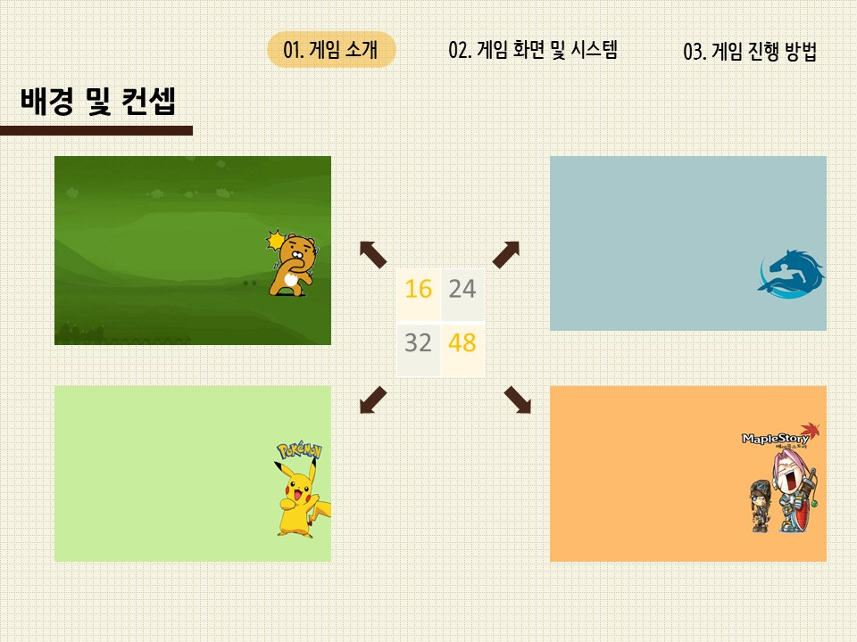
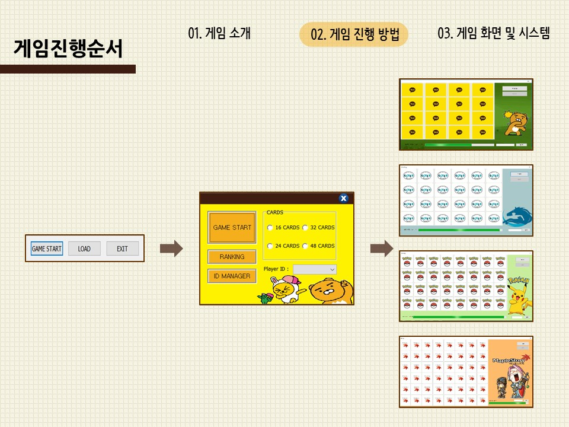
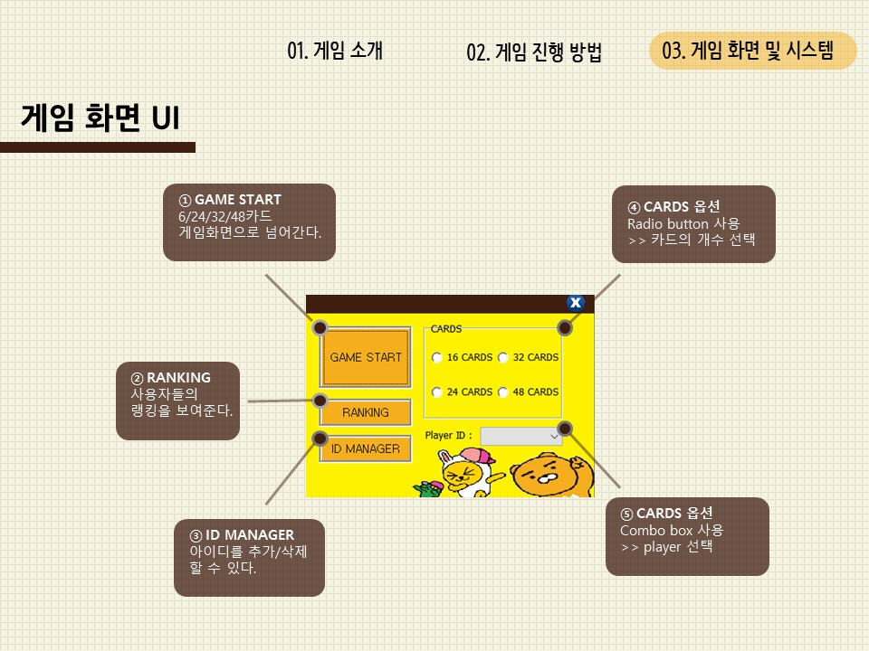
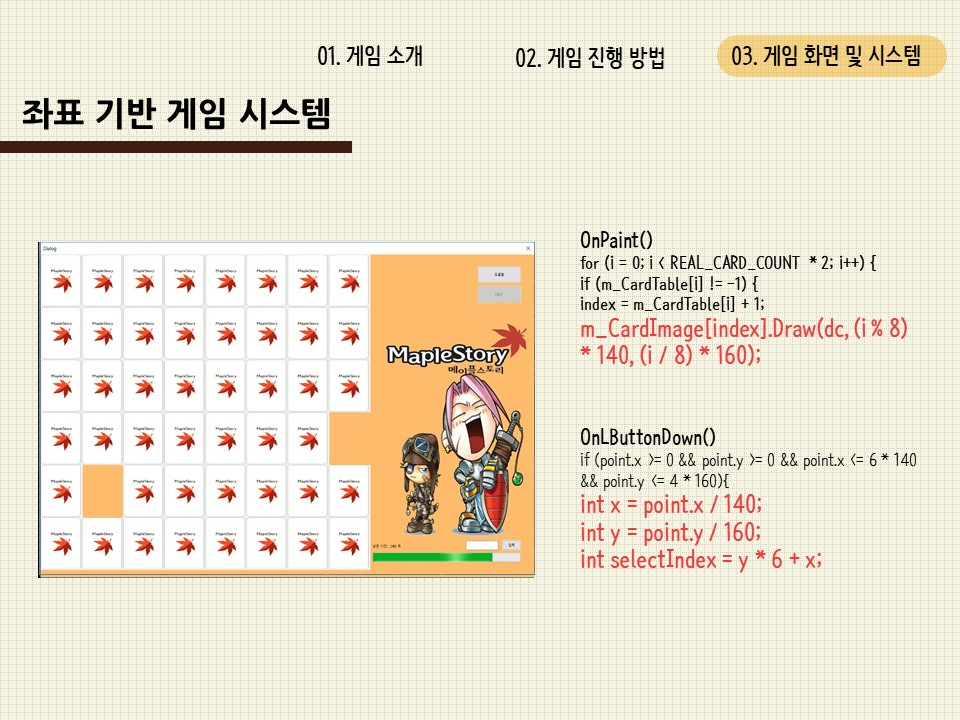
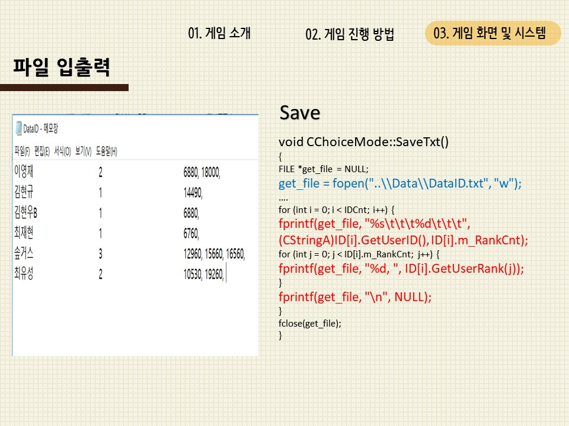
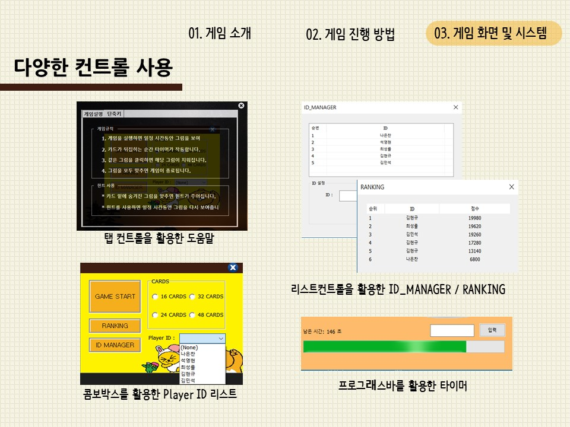

# Matching-Game

Soongsil software 2-2 window programing project(MFC)

&nbsp;

# Presentation(ppt)

    

        
    

    

        
    

    

        
    

    

        
    

    

        
    

    

        
    

    

        
    

    

        
    

    

        
    

    

        
    

    

        
    

    

        
    

    

        
    

    

        
    

    

        
    

    

        
    

    

        
    

